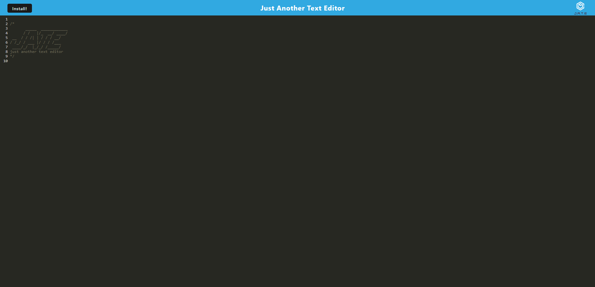
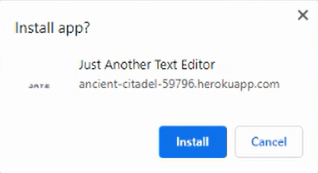
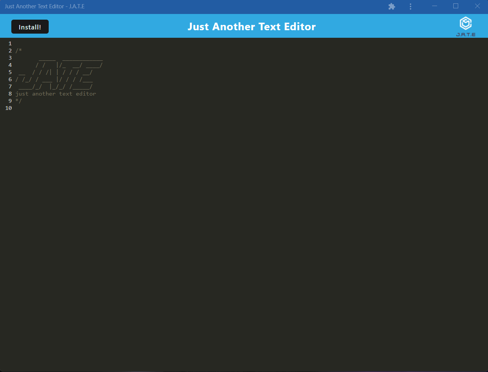

# Text-Editor
## Description

The goal was to modify an existing code to impliment Progressive Web Application features.

## Live Deployment link

The live deployment of the site can be found at: https://ancient-citadel-59796.herokuapp.com/

## Usage

The app can be used by visiting the live deployment link in the section above. When the site is visited the page will look something like the image below

In the black area text can be entered to make notes. All changes to the text are saved to indexDB. In the top left corner clicking the install button will display a prompt shown in the first image below. Clicking the install button in the prompt will install the application to your computer where it can be used offline and outside the web browser. The second image below shows what the application looks like when installed.

## Credits

Site developper(s):
- Jordan Pletzer: https://github.com/pletzjd

Initial code provided by:
- University of Toronto School of Continuing Studies: https://bootcamp.learn.utoronto.ca/coding/curriculum/

## License

MIT License

Copyright (c) [2022] [Jordan Daniel Joseph Pletzer]

Permission is hereby granted, free of charge, to any person obtaining a copy
of this software and associated documentation files (the "Software"), to deal
in the Software without restriction, including without limitation the rights
to use, copy, modify, merge, publish, distribute, sublicense, and/or sell
copies of the Software, and to permit persons to whom the Software is
furnished to do so, subject to the following conditions:

The above copyright notice and this permission notice shall be included in all
copies or substantial portions of the Software.

THE SOFTWARE IS PROVIDED "AS IS", WITHOUT WARRANTY OF ANY KIND, EXPRESS OR
IMPLIED, INCLUDING BUT NOT LIMITED TO THE WARRANTIES OF MERCHANTABILITY,
FITNESS FOR A PARTICULAR PURPOSE AND NONINFRINGEMENT. IN NO EVENT SHALL THE
AUTHORS OR COPYRIGHT HOLDERS BE LIABLE FOR ANY CLAIM, DAMAGES OR OTHER
LIABILITY, WHETHER IN AN ACTION OF CONTRACT, TORT OR OTHERWISE, ARISING FROM,
OUT OF OR IN CONNECTION WITH THE SOFTWARE OR THE USE OR OTHER DEALINGS IN THE
SOFTWARE.